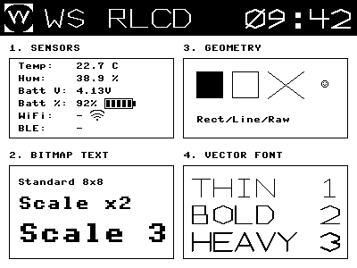

# Waveshare ESP32 S3 4.2inch RLCD Driver (MicroPython)

This project provides a high-performance MicroPython driver for the [Waveshare 4-inch Reflective RLCD](https://docs.waveshare.com/ESP32-S3-RLCD-4.2). It utilizes the standard `framebuf` library for graphics primitives and an optimized SPI transmission method to update the display.

**DISCLAIMER**: Most of this code has been generated by Gemini 3.

Here's a sample output of the library:



## Features

*   **High Performance**: Uses `micropython.native` decorators and optimized buffer mapping for fast refresh rates.
*   **Graphics Primitives**: Supports pixels, lines, rectangles, filled rectangles, and standard text via `framebuf`.
*   **Advanced Graphics**: 
    *   Scalable text rendering (`text_large`).
    *   PBM image loading and rendering (`draw_pbm`).
    *   Raw bitmap support.
*   **Utilities**: Screen capture functionality (`save_screenshot`) to save the current display state to a file.

## Hardware Requirements

*   **Microcontroller**: ESP32 (Tested on ESP32-S3, adaptable to others).
*   **Display**: Waveshare 4-inch RLCD (SPI interface).
    *   **Screen Type:** 4.2" Reflective LCD (Memory-In-Pixel), 400x300 resolution.
    *   **Interface:** SPI.
    *   **Color Format:** 1-bit Monochrome (Bit-packed). 0=White/Silver, 1=Black.
    *   **Controller:** Custom/ST7305-like.
    *   **Pinout:**
        *   **MOSI:** 12
        *   **SCK:** 11
        *   **DC:** 5
        *   **CS:** 40
        *   **RST:** 41

### Default Wiring (as used in `main.py`)

| RLCD Pin | ESP32 Pin | Description |
| :--- | :--- | :--- |
| VCC | 3.3V | Power |
| GND | GND | Ground |
| DIN | GPIO 12 | MOSI (SPI Data) |
| CLK | GPIO 11 | SCK (SPI Clock) |
| CS | GPIO 40 | Chip Select |
| DC | GPIO 5 | Data/Command |
| RST | GPIO 41 | Reset |

*Note: Pin assignments can be changed during initialization.*

## Installation

1.  Flash your ESP32 with the latest [MicroPython firmware](https://micropython.org/download/ESP32_GENERIC_S3/).
    1. `esptool --port /dev/cu.usbmodemXXXXX erase-flash`
    2. `esptool --chip esp32s3 --port /dev/cu.usbmodemXXXXX --baud 460800 write_flash -z 0 ~/Downloads/ESP32_GENERIC_S3-XXXXXXXX-vXXXXXXX.bin`
2.  Upload `rlcd.py`, `shtc3.py`, `sensors.py` and `vector.py` to the ESP32 filesystem.
3.  Run `make_logo.py` which generates a nice pbm image that is used in the demo.
4.  Run `main.py` to see a demo of the current capabilities.
5.  To allow the device to connect to a WiFi network, create a `secrets.py` file with the following format:
    ```python
    # Wi-Fi Networks configuration
    WIFI_NETWORKS = {
        "YOUR_WIFI_SSID": "YOUR_WIFI_PASSWORD",
        "ANOTHER_SSID": "ANOTHER_PASSWORD"
    }
    ```

## Usage

### Basic Example

```python
import rlcd
from machine import Pin, SPI

# 1. Setup SPI
spi = SPI(2, baudrate=20000000, polarity=0, phase=0, 
          sck=Pin(11), mosi=Pin(12))

# 2. Initialize Display
display = rlcd.RLCD(spi, cs=Pin(40), dc=Pin(5), rst=Pin(41))

# 3. Draw
display.clear(0) # Clear to white (0=White, 1=Black on RLCD)
display.text("Hello RLCD!", 50, 50, 1)
display.fill_rect(50, 70, 100, 20, 1)

# 4. Update Screen
display.show()
```

## RLCD Class Documentation

The `RLCD` class in `rlcd.py` is the core driver.

### Initialization

```python
display = RLCD(spi, cs, dc, rst, width=400, height=300)
```
*   **spi**: Configured `machine.SPI` object.
*   **cs**: `machine.Pin` object for Chip Select.
*   **dc**: `machine.Pin` object for Data/Command.
*   **rst**: `machine.Pin` object for Reset.
*   **width/height**: Display dimensions (default 400x300).

### Drawing Methods

| Method | Description |
| :--- | :--- |
| `clear(c=0)` | Fills the entire screen with color `c` (0 or 1). |
| `pixel(x, y, c)` | Draws a single pixel at `x, y`. |
| `line(x1, y1, x2, y2, c)` | Draws a line from `x1, y1` to `x2, y2`. |
| `rect(x, y, w, h, c)` | Draws a rectangle outline. |
| `fill_rect(x, y, w, h, c)` | Draws a filled rectangle. |
| `text(msg, x, y, c=1)` | Draws standard 8x8 text. |

### Advanced Methods

#### `text_large(msg, x, y, scale=2, c=1)`
Draws text scaled by an integer factor.
*   **scale**: Integer multiplier for size (e.g., 2 is 16x16px).

#### `draw_pbm(filename, x, y, scale=1)`
Loads a PBM (Portable Bitmap) image from the filesystem and draws it.
*   **filename**: Path to `.pbm` file (Must be P4 binary format).
*   **scale**: Integer scaling factor.

#### `bitmap(x, y, w, h, pixel_data)`
Blits a raw bytearray of pixel data to the screen.
*   **pixel_data**: `bytearray` in `MONO_HLSB` format.

### System Methods

#### `show()`
Transfers the internal frame buffer to the physical display. **Must be called to see any changes.**

#### `save_screenshot(filename)`
Saves the current screen content to a PBM file on the ESP32 filesystem.
```python
display.save_screenshot('capture.pbm')
```

#### `reset()`
Performs a hardware reset of the display.

## File Formats

*   **Images**: The driver supports **PBM P4** (binary) format. You can convert images to this format using GIMP (Export as PBM -> Raw) or ImageMagick:
    `convert image.png -resize 400x300 -monochrome -compress none output.pbm` (Note: ensure header is P4, not P1).

## Example Output

The demo script `main.py` saves a screenshot of the display. You can view the raw output file here: output.pbm